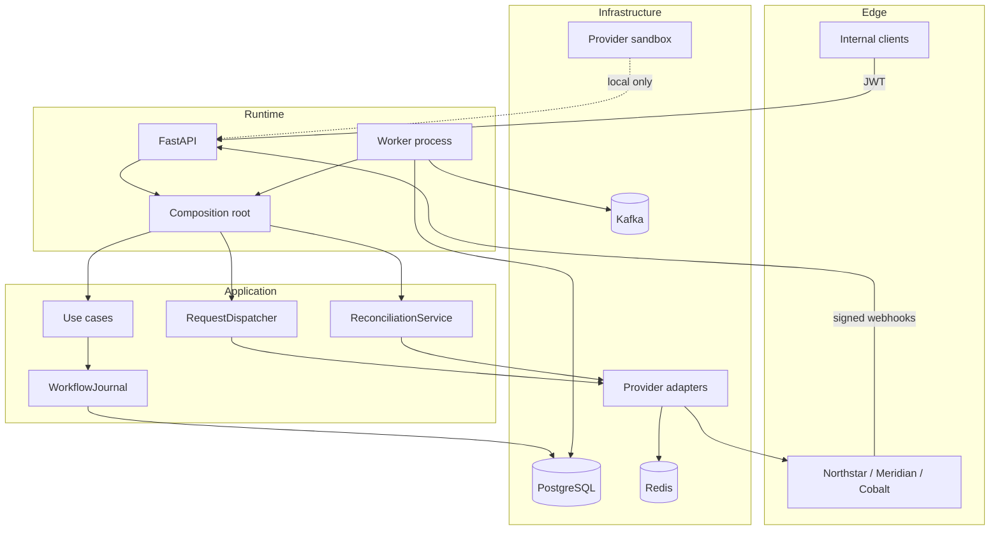

# Component view

```mermaid
flowchart TB
    subgraph edge [Edge]
        Client[Internal clients]
        Providers[Northstar / Meridian / Cobalt]
    end

    subgraph runtime [Runtime]
        API[FastAPI]
        Workers[Worker process]
        Comp[Composition root]
    end

    subgraph app [Application]
        UC[Use cases]
        Disp[RequestDispatcher]
        Rec[ReconciliationService]
        Journal[WorkflowJournal]
    end

    subgraph infra [Infrastructure]
        PG[(PostgreSQL)]
        Redis[(Redis)]
        Kafka[(Kafka)]
        Adapters[Provider adapters]
        Sandbox[Provider sandbox]
    end

    Client -->|JWT| API
    Providers -->|signed webhooks| API
    API --> Comp
    Workers --> Comp
    Comp --> UC
    Comp --> Disp
    Comp --> Rec
    UC --> Journal
    Disp --> Adapters
    Rec --> Adapters
    Journal --> PG
    Adapters --> Redis
    Adapters --> Providers
    Workers --> Kafka
    Workers --> PG
    Sandbox -. local only .-> API
```
