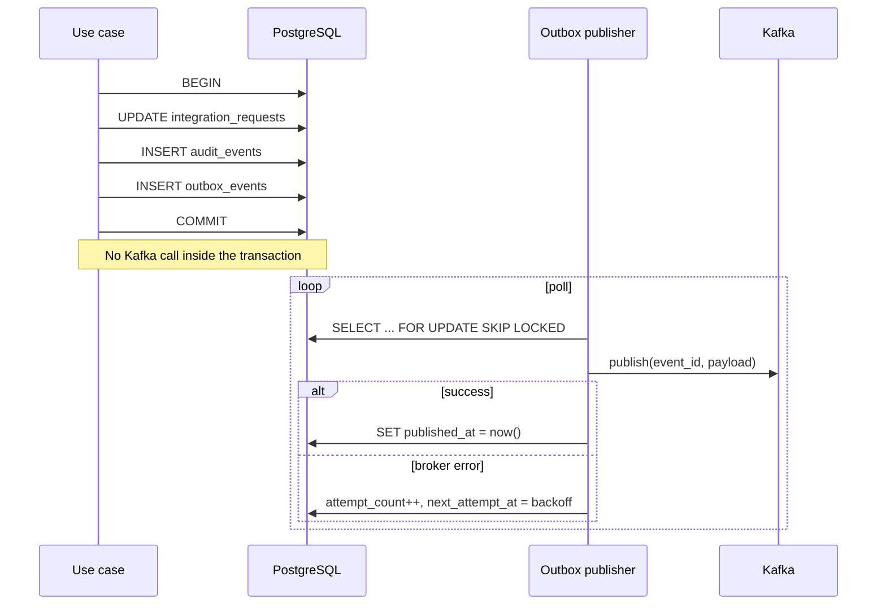

# Transactional outbox flow

```mermaid
sequenceDiagram
    participant UC as Use case
    participant DB as PostgreSQL
    participant OP as Outbox publisher
    participant K as Kafka

    UC->>DB: BEGIN
    UC->>DB: UPDATE integration_requests
    UC->>DB: INSERT audit_events
    UC->>DB: INSERT outbox_events
    UC->>DB: COMMIT
    Note over UC,DB: No Kafka call inside the transaction

    loop poll
        OP->>DB: SELECT ... FOR UPDATE SKIP LOCKED
        OP->>K: publish(event_id, payload)
        alt success
            OP->>DB: SET published_at = now()
        else broker error
            OP->>DB: attempt_count++, next_attempt_at = backoff
        end
    end
```
