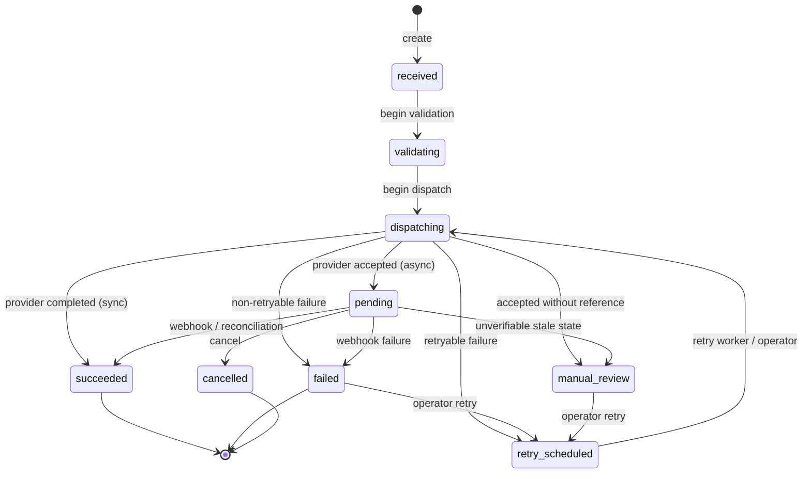

# Request lifecycle

```mermaid
stateDiagram-v2
    [*] --> received: create
    received --> validating: begin validation
    validating --> dispatching: begin dispatch
    dispatching --> pending: provider accepted (async)
    dispatching --> succeeded: provider completed (sync)
    dispatching --> failed: non-retryable failure
    dispatching --> retry_scheduled: retryable failure
    dispatching --> manual_review: accepted without reference
    retry_scheduled --> dispatching: retry worker / operator
    pending --> succeeded: webhook / reconciliation
    pending --> failed: webhook failure
    pending --> cancelled: cancel
    pending --> manual_review: unverifiable stale state
    failed --> retry_scheduled: operator retry
    manual_review --> retry_scheduled: operator retry
    succeeded --> [*]
    failed --> [*]
    cancelled --> [*]
```

`failed` is not terminal in the sense that an operator can restore it for retry.
`succeeded` and `cancelled` are terminal.
