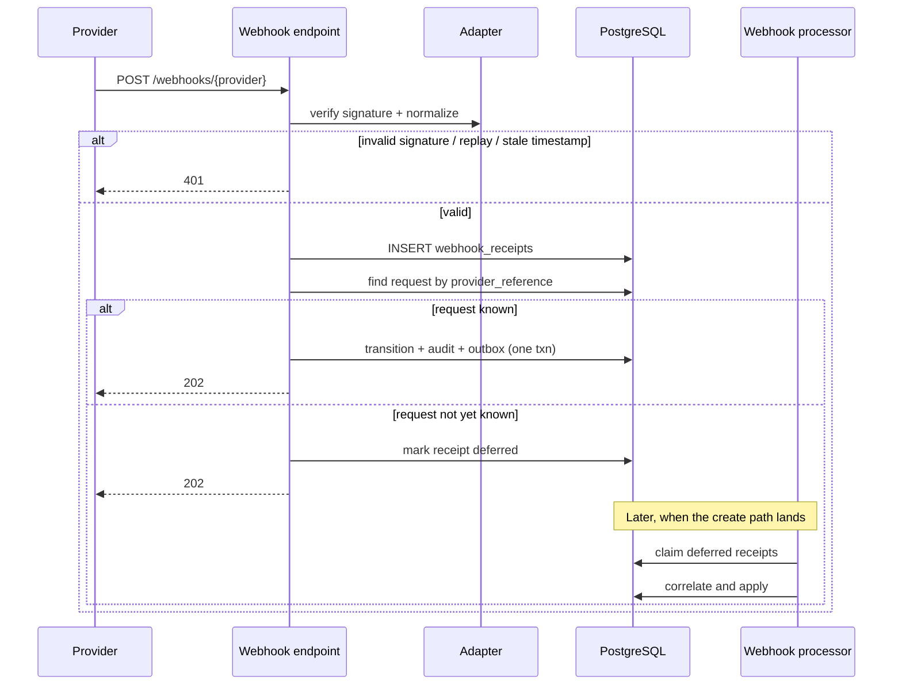

# Webhook ingestion

Persisting the receipt before correlation is what makes the webhook-before-response
race recoverable. Acknowledging 202 for duplicates prevents provider retry storms
without re-applying the event.
